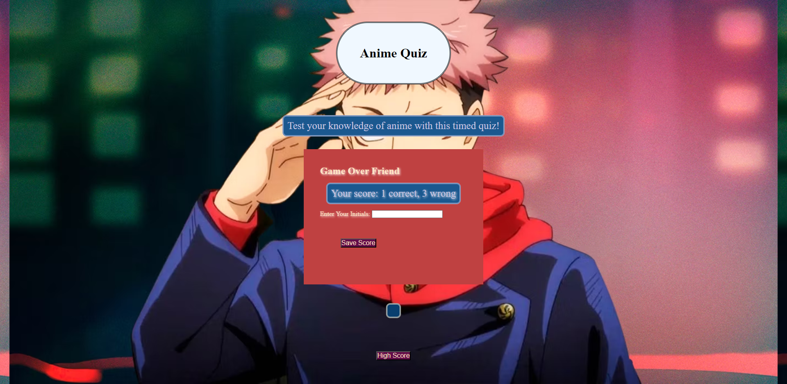

# Anime-Quiz
This quiz will test your anime knowledge!

## Description
This timed quiz serves as an intense exercise with vanilla js functionalities. Be warned!

- My main motivation for this style of challenge was the practice use of timers and local storage with JS.

- It took the course of about 3 days and really studying to see the flow in building something like this. I can't wait to play with jQuery and Bootstrap though!

- In reality , I feel like this solved my need to understand JS more.

- I learned that styling something like this from scratch is definitely going to take me more practice. Cant wait!

## Usage
Start the quiz and see how many of these questions you can get right! Then, enter your high score for the local leaderboard.

Follow the link to the short quiz!
- https://mrobles-dev.github.io/Anime-Quiz/

##Acknowledgements

- https://simplestepscode.com/javascript-quiz-tutorial/

- https://stackoverflow.com/questions/44314897/javascript-timer-for-a-quiz

- https://www.youtube.com/@JamesQQuick

Thank you all.

##License

MIT License

Copyright (c) 2023 Milton Robles

Permission is hereby granted, free of charge, to any person obtaining a copy
of this software and associated documentation files (the "Software"), to deal
in the Software without restriction, including without limitation the rights
to use, copy, modify, merge, publish, distribute, sublicense, and/or sell
copies of the Software, and to permit persons to whom the Software is
furnished to do so, subject to the following conditions:

The above copyright notice and this permission notice shall be included in all
copies or substantial portions of the Software.

THE SOFTWARE IS PROVIDED "AS IS", WITHOUT WARRANTY OF ANY KIND, EXPRESS OR
IMPLIED, INCLUDING BUT NOT LIMITED TO THE WARRANTIES OF MERCHANTABILITY,
FITNESS FOR A PARTICULAR PURPOSE AND NONINFRINGEMENT. IN NO EVENT SHALL THE
AUTHORS OR COPYRIGHT HOLDERS BE LIABLE FOR ANY CLAIM, DAMAGES OR OTHER
LIABILITY, WHETHER IN AN ACTION OF CONTRACT, TORT OR OTHERWISE, ARISING FROM,
OUT OF OR IN CONNECTION WITH THE SOFTWARE OR THE USE OR OTHER DEALINGS IN THE
SOFTWARE.
